# Section 5
## Budget Setup
We can debug our bills using the AWS billing section, you can find the different services that you are using and the carge also with the region
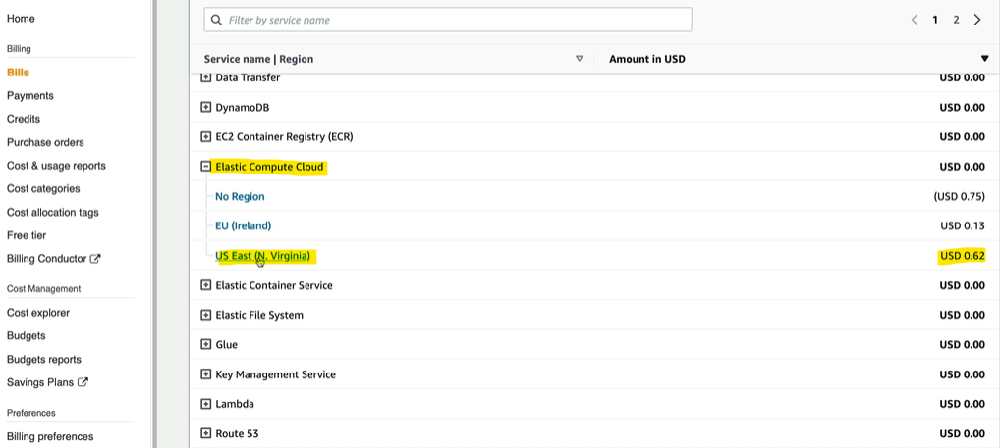
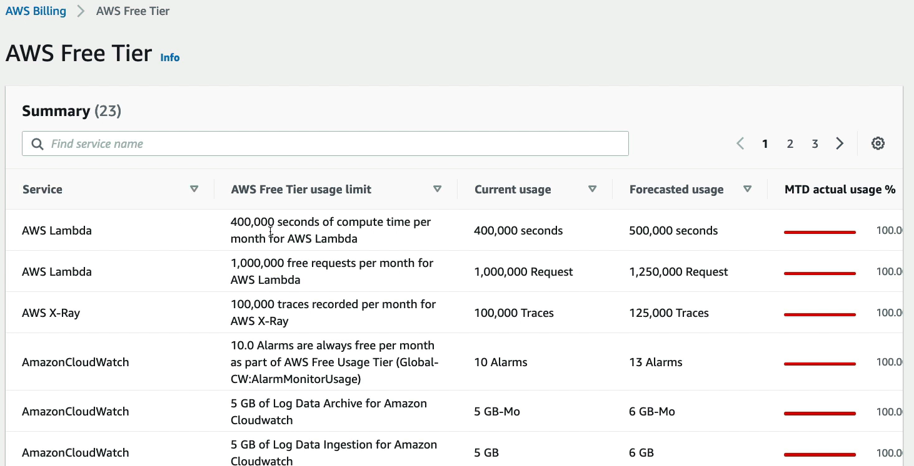

To void cost the best practice is to create a budget, you can choose your budget type and use a template

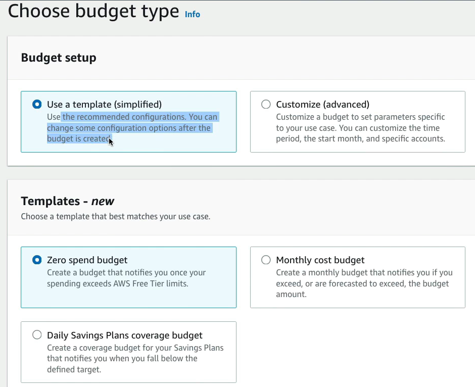

-----
# EC2 Section
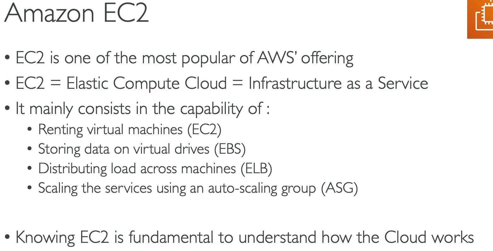
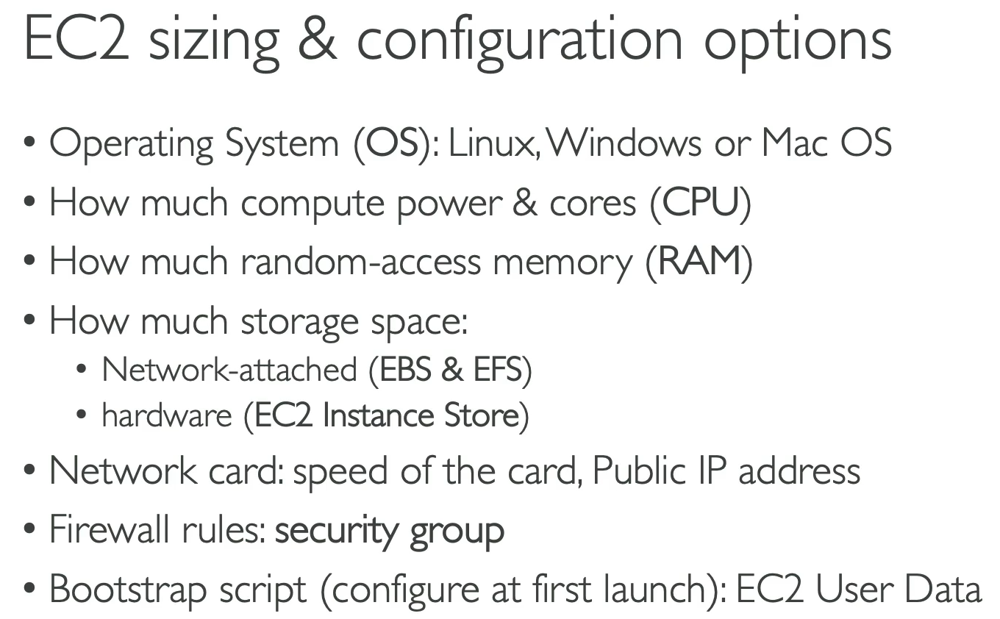

You should select the instance that fit best with your application depending of the demand.

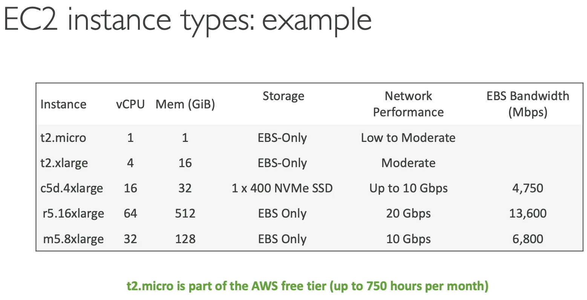

## Create and EC2 instance with EC2 User Data to have a Website Hands On

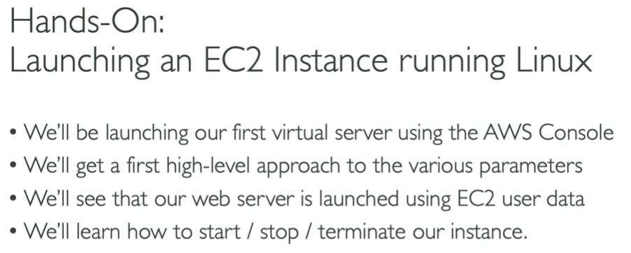

* Define the name and tag
* Choose a OS system (linux, ubuntu, windows)
* Select Amazon Machine Image (default is free)
* Select Instance type (t2.micro) is free for a month
* Create a Key Pair (RSA and .pem)
* Network 
    * Allow SSH traffic from anywhere
    * Allow HTTP traffic from the internet
* User data: Here we add a script with a command that will execute in the first launch, only once in the hole life cycle of the instance. It is going to update some things and install the **HTTPD** web server on the machine and write an html file to see in the website
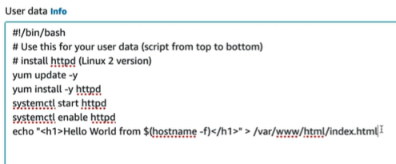

**NOTE** Without a server i'm able to create one or a hundred of instances in just a couple of seconds.  

* If you stop and instant and then rerun, aws is going to change de Public IP Address

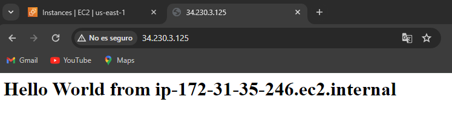

---
## EC2 Instance Types
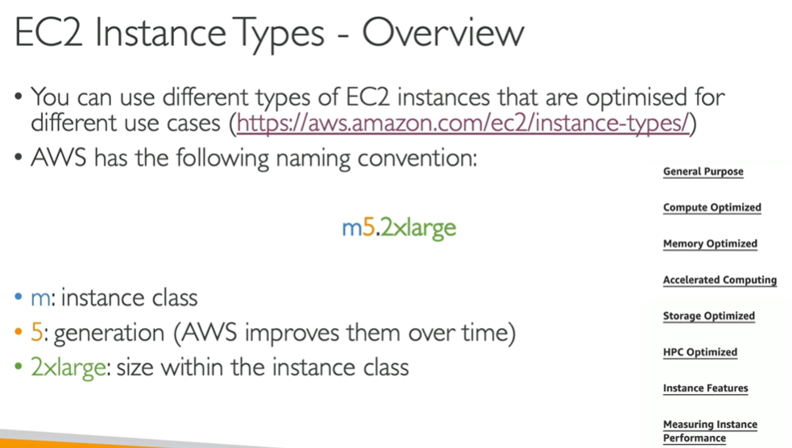

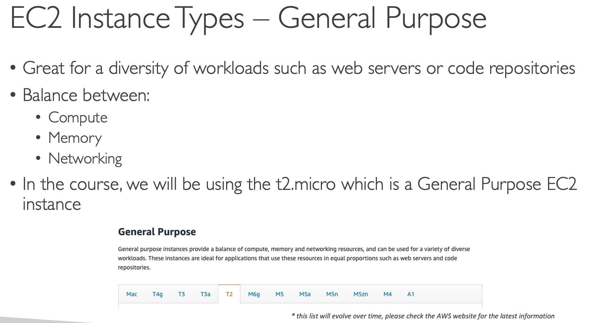