# Section 5
## Budget Setup
We can debug our bills using the AWS billing section, you can find the different services that you are using and the carge also with the region

To void cost the best practice is to create a budget, you can choose your budget type and use a template

-----
# EC2 Section

You should select the instance that fit best with your application depending of the demand.

## Create and EC2 instance with EC2 User Data to have a Website Hands On

* Define the name and tag
* Choose a OS system (linux, ubuntu, windows)
* Select Amazon Machine Image (default is free)
* Select Instance type (t2.micro) is free for a month
* Create a Key Pair (RSA and .pem)
* Network 
    * Allow SSH traffic from anywhere
    * Allow HTTP traffic from the internet
* User data: Here we add a script with a command that will execute in the first launch, only once in the hole life cycle of the instance. It is going to update some things and install the **HTTPD** web server on the machine and write an html file to see in the website

        #!/bin/bash
        # Use this for your user data (script from top to bottom)
        # install httpd (Linux 2 version)
        yum update -y
        yum install -y httpd
        systemctl start httpd
        systemctl enable httpd
        echo "<h1>Hello World from $(hostname -f)</h1>" > /var/www/html/index.html

**NOTE** Without a server i'm able to create one or a hundred of instances in just a couple of seconds.  

* If you stop and instant and then rerun, aws is going to change de Public IP Address

---
## EC2 Instance Types

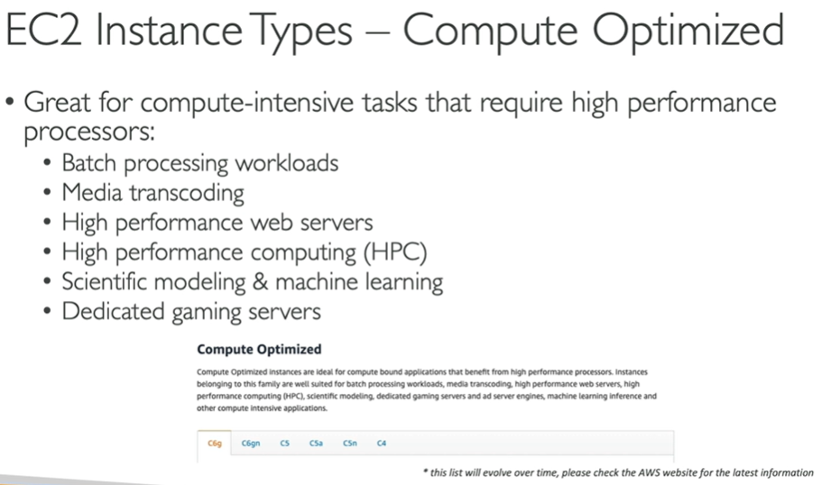

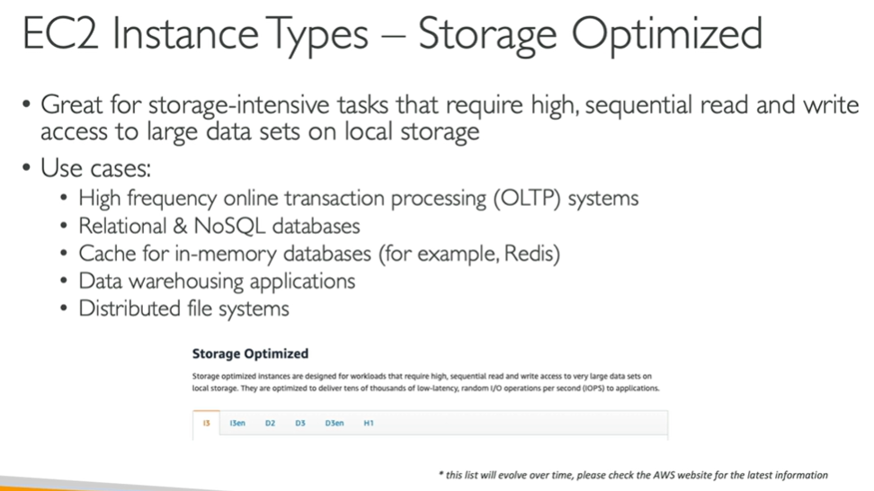

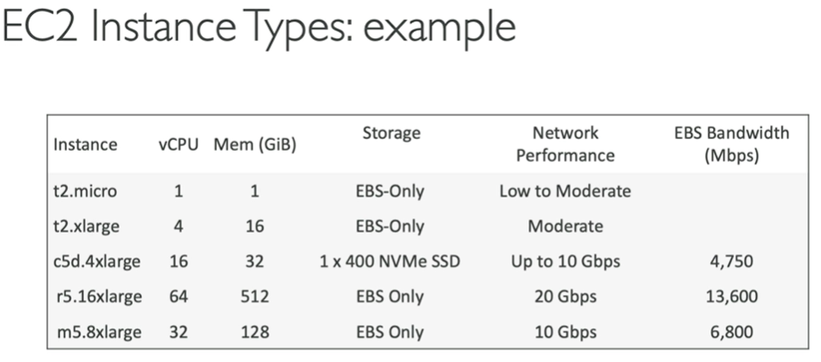

## EC2 Security Groups
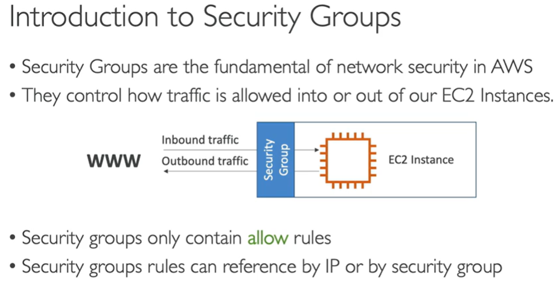

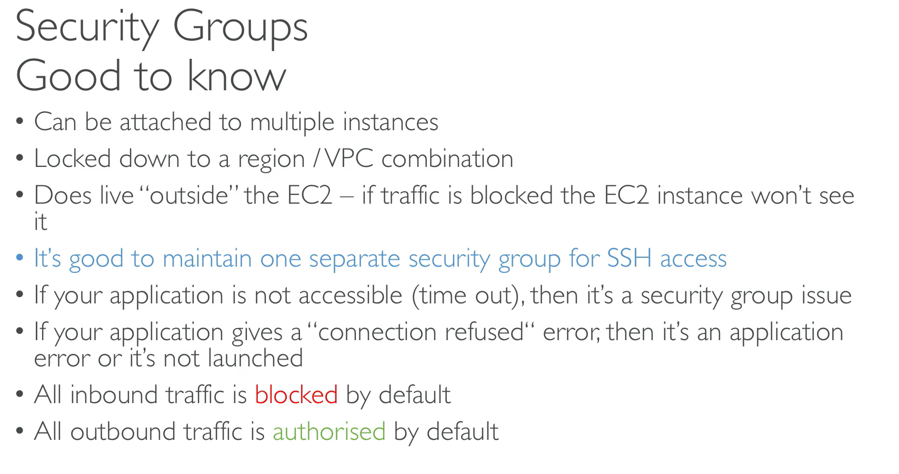

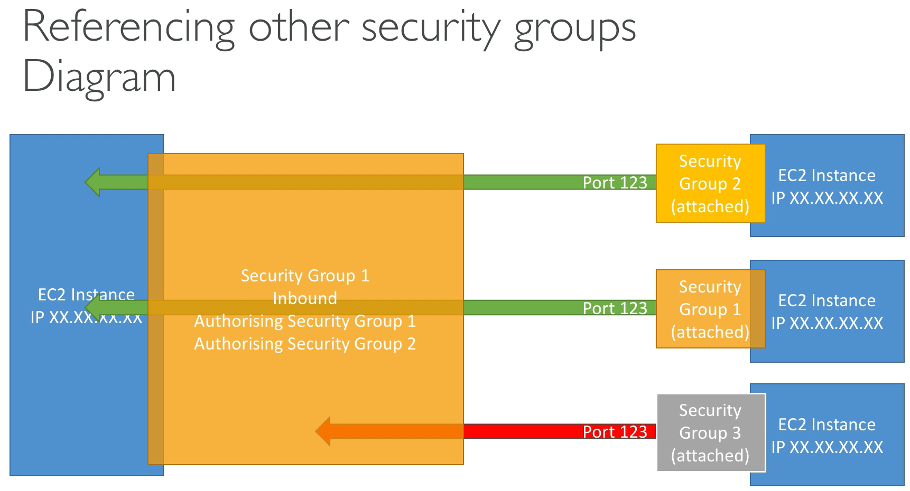

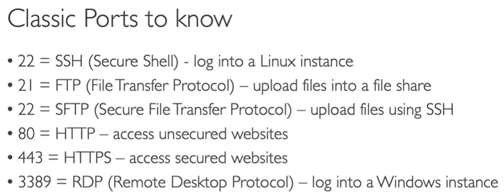

## How to SSH using Windows 10
1. Make sure your instance is running
2. Make sure your Key Pair are included in your instance
3. Steps to find in aws the commands needed to stablish the ssh connection in your console
    - Select the instance
    - Select the connect button
    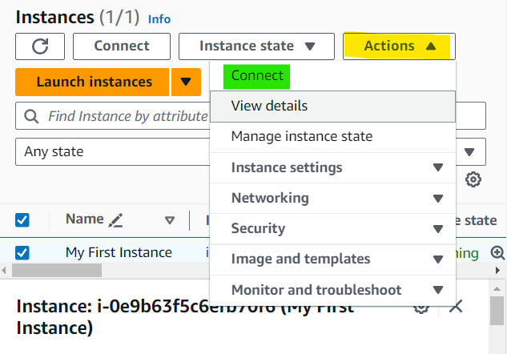
    - Here you will find the commands that you need to execute
    - Remember to go to the route of your .pem file (the one that is generated with the key pairs) when you execute this command
    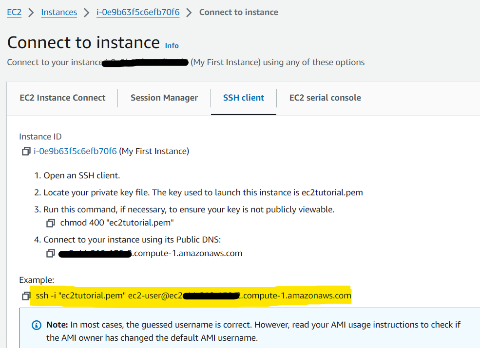
    
    
This is what appears when you execute the command. Now we are connected to AWS with our terminal
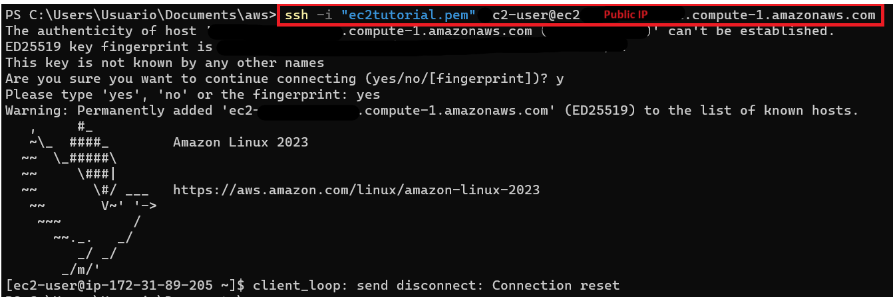

This is another way to connect to ssh using not the IP Public address DNS as in the previous example. Here we use the normal IP Public as the tutor said
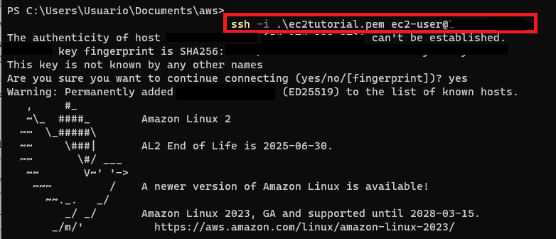

# Instance Connect
This is another method that is connect directly the instance in the aws console
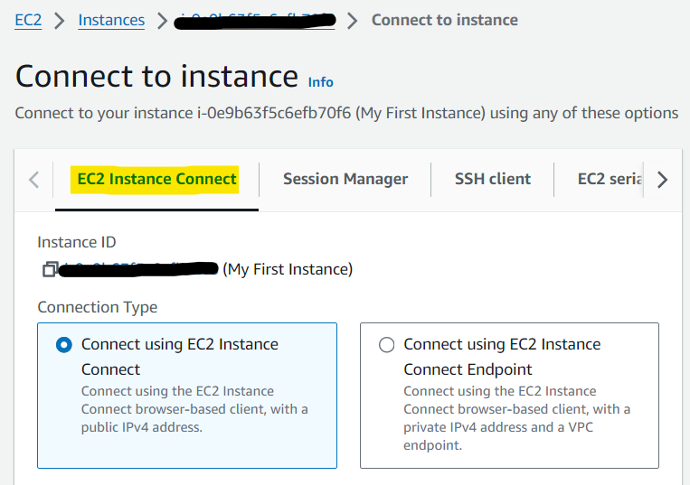

**Note:** This ssh connections is allowed thanks to the security group the port 22 that we configured before from any source.

---
We need to configure our aws but we should use always the credentials of an iam role, not our private credentials. If we check in the Security tab of our instance, we dont have a role assigned.

Here we select "Modify IAM role" and select the role that we already created. 
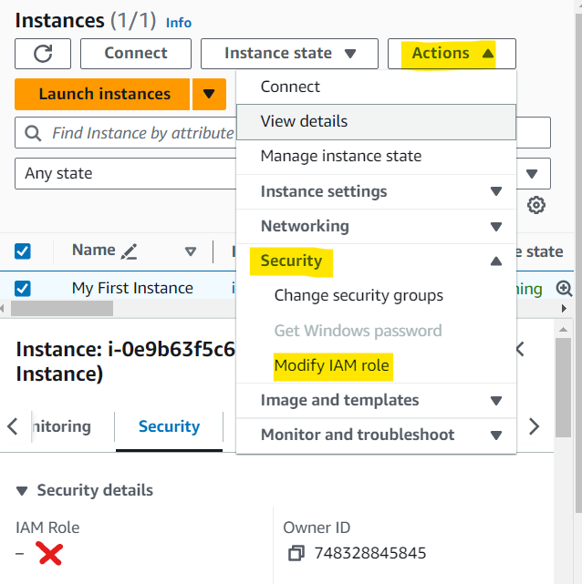

---
**NOTE**: Remember that this role had the permission to read
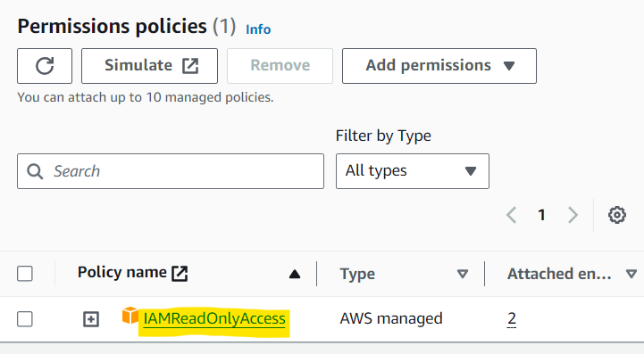

After adding this IAM Role we are now able to list the users because we have the access
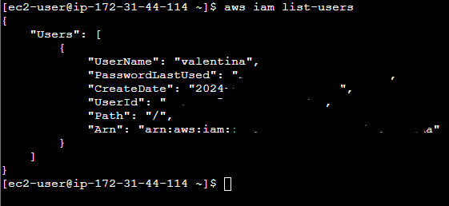

---
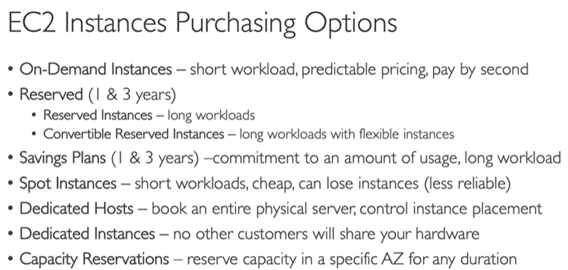

With the following example we can understand a little bit more about the purchasing options
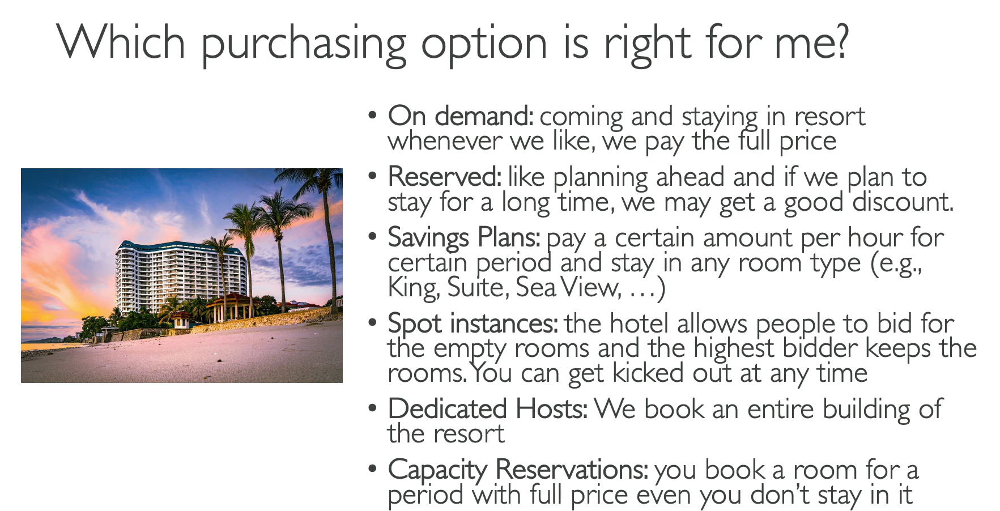

---
This is a specific example of **SPOT instance**
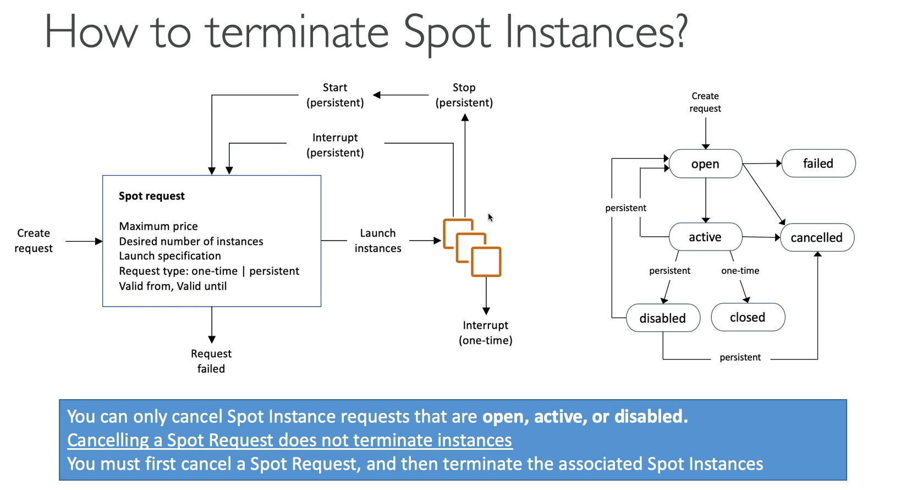